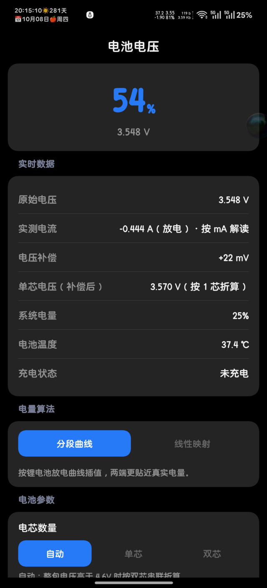
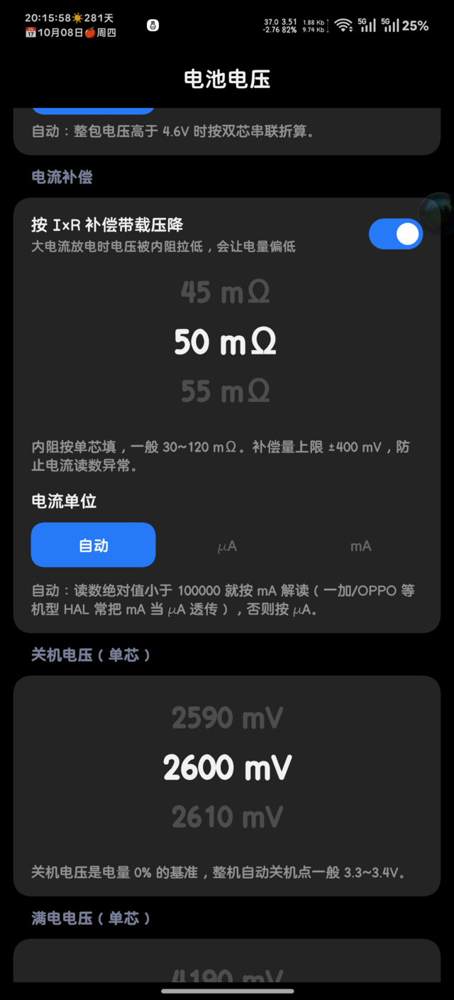
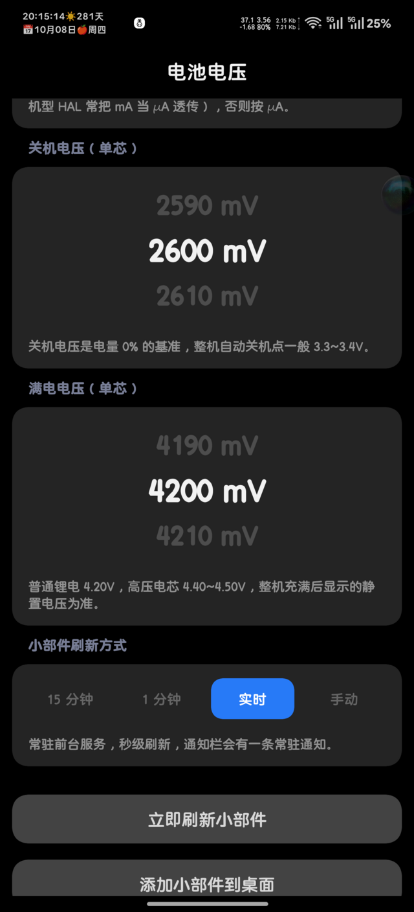

# 电池电压 · VoltMeter

用**电压**估算电量的 Android 桌面小部件。**零权限、不需要 root**，界面用 [MIUIX](https://github.com/compose-miuix-ui/miuix)（Compose Multiplatform）写。

<p align="center">
  
</p>

## 它和系统电量有什么不同

系统百分比来自库仑计，本项目的百分比来自 **实测电压 + 你自己填的关机/满电电压**。两者必然不一样：

- **息屏静置时最接近**；亮屏重载时电压被电池内阻拉低，会偏低——可以打开「电流补偿」把压降补回来
- 好处是**「0%」由你定义**（比如你认为 3.4V 就该关机），而且能直接在桌面上看到实时电压

## 功能

- **桌面小部件**：大字百分比 + 实时电压；充电时显示「· 充电中」并把百分比变绿；点一下立即刷新
- **零权限**：只读 `ACTION_BATTERY_CHANGED` 的 sticky 广播和 `BatteryManager`，不申请任何敏感权限，不使用 root
- **电量算法二选一**：分段曲线（锂电池 OCV-SOC 经验折线，推荐）/ 线性映射
- **参数全可调**：电芯数（自动 / 单芯 / 双芯）、单芯关机电压 2000~4500 mV、单芯满电电压 3800~4500 mV
- **电流补偿**：`V_静置 ≈ V_实测 + (-I × R)`，内阻 0~300 mΩ 可调，补偿量限幅 ±400 mV
  - 电流**单位自动识别**：一加/OPPO 等机型的 HAL 会把 mA 当 µA 透传，会自动纠正，也可以手动指定
  - 电流**正负号**按充电状态自动纠正，不依赖厂商定义
- **小部件刷新四档**：15 分钟 / 1 分钟 / 实时（前台服务秒级）/ 手动
- **改完即生效**：任何参数改动 0.3 秒后自动保存并同步到小部件，不需要点「保存」

## 截图

<p align="center">
  
  
  
</p>

## 下载

去 [Releases](../../releases) 取 APK。目前 release 包用 debug 签名（方便自编译、自用），不是正式发布签名。

## 构建

### 电脑上（推荐）

需要 JDK 17+、Android SDK（`compileSdk 37` / `build-tools 36.1.0`）：

```bash
git clone https://github.com/<you>/VoltMeter.git
cd VoltMeter
./gradlew :app:assembleDebug        # 产物在 app/build/outputs/apk/debug/
./gradlew :app:assembleRelease      # 需要签名的话见下
```

SDK 路径写在 `local.properties` 的 `sdk.dir=`，或者用 `ANDROID_HOME` 环境变量。

正式签名（可选）：设置环境变量 `VOLT_KEYSTORE` / `VOLT_KEYSTORE_PASSWORD` / `VOLT_KEY_ALIAS` / `VOLT_KEY_PASSWORD`，release 构建就会用你的 keystore；不设置则退回 debug 签名。

### 在 Android 手机上直接编译（不需要电脑）

见 [docs/BUILD-ON-DEVICE.md](docs/BUILD-ON-DEVICE.md)：用 proot 里的 Ubuntu + `qemu-user-static` 转译官方 x86_64 版 `aapt2`，实测可用。

## 技术栈

| 组件 | 版本 |
|---|---|
| Kotlin | 2.4.20 |
| Compose Multiplatform | 1.12.1 |
| Android Gradle Plugin | 9.4.1 |
| Gradle | 9.8.1 |
| MIUIX | 0.9.4 |
| minSdk / targetSdk / compileSdk | 26 / 36 / 37 |

## 已知问题与机型差异

- **电压推电量天然不准**：负载、温度、电芯老化都会影响，请当参考值，别用于精确计量
- 一加/OPPO 系机型的 `BATTERY_PROPERTY_CURRENT_NOW` 实际单位是 mA（不是 API 名义上的 µA）
- 双电芯机型上报的电压可能是**单芯等效值**（本项目在一加 13 上实测就是 3.3~4.5V 的单芯值），所以「电芯数量」留了自动 / 单芯 / 双芯三档
- Android 不允许普通应用在后台秒级刷新，所以「实时」档用前台服务实现，会有一条常驻通知

## 许可

[GPL-3.0](LICENSE)

界面组件 [MIUIX](https://github.com/compose-miuix-ui/miuix) 由 YuKongA 等开发，Apache-2.0。
